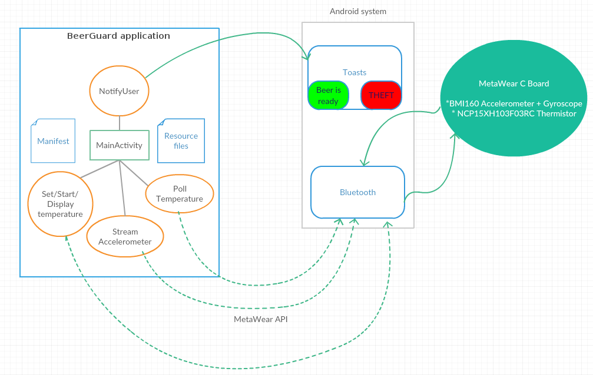

# BeerGuard

## Executive Summary
Attending a social function with a strict BYOB policy brings with it many challenges. 
Chiefly, one must devise a heuristic to ensure that their beverage of choice remains both  
secure, and at a satisfactory temperature whilst in holding (in a fridge/ice bucket - before 
being consumed). 

To this end, a system has been devised which makes use of the MetaWearC board - 
alongside an Android smartphone - to develop a distributed platform that will: 

* notify a user when their beer is cold enough & ready for consumption
* notify a user if their beer is moved from the fridge/ice bucket before it is cold enough, 
and thus implying it is being stolen.

## Project Goals
* Use the MetaWear C board as part of a temperature reporting system. It is to be inserted 
into a beer/drink sleeve (possibly insulated with a waterproof plastic coat), encapsulating a 
bottle of beer/other drink,  and left in the fridge/ice bucket. The board will be consulted at 
various intervals by an Android application via callbacks with BLE information to obtain an 
approximate temperature of the ambient surroundings, and thus the 
beverage itself.

* The board's accelerometer functionalities will be used in an anti-theft system, 
to notify the mobile application should the drink in question be forcefully removed from the 
fridge before the board reports the desired temperature.

* Present the results of the above functionalities in an Android application that allows for 
custom temperatures to be set. 

## Merit to society
* This project will relieve party goers of undue stress & trauma stemming from
any uncertainty they may have about the security and temperature of their beer whilst left to cool
in alien and potentially hostile environments. 

## Potential issues
* Prevent the anti-theft functionality from being triggered by innocuous movements. As in, 
theft warnings should not be set off via a "hair trigger" that is invoked upon the merest of
movements, such as another party patron accidentally knocking over bottles in the fridge/ice bucket as 
they search for their own drink. This should be accomplished by setting appropriate frequency 
boundaries for accelerometer data during streaming.

* ensure that the BLE signal is able to be picked up through the relatively thick walls of a 
common household fridge without significant delay/loss of data integrity. If this is not
possible, then the scope of the project will be reduced to only being applicable when the 
drinks are being store in an open-air ice bucket (which is not entirely unrealistic).

* ensuring that the temperature of the ambient surroundings really is indicative of the temperature of the beer. 
This will be accomplished through ample manual testing beforehand with a standard thermometer, 
standard ice-bucket/fridge, and standard beer

* ensuring that the user becomes aware should connectivity with the MetaWearC board drop for whatever reason.

* ensuring that the application does not drain excessive amounts of battery life of the Android
phone whilst polling temperature data/streaming accelerometer data.

## High Level Design

## Component List
### MetaWear C Board
The MetaWear C Board's thermistor will be used to gauge temperature from within
a fridge or ice bucket. Additionally, the accelerometer will be used to stream motion 
data.

### BeerGuard application
This is the application that will be built as part of this project. It will in interface
with the MetaWear C Board's Android API to pull temperature data Additionally, 
accelerometer data will start streaming from the board to the application during the "cooling" phase to detect spikes in movement. 

### Main Activity
MainActivity.java will link the subsequent activities together:

#### Set/start/display beverage temperature activity & NotifyUser activity
This activity will allow users to set an ideal temperature for their beer, in Fahrenheit or Celsius.
Once this is set, the app will interface with the MetaWear Android API through the activities described below
to display the current temperature of the beer. The user will receive a toast notification once the API
reports that the beer is at the desired temperature. Additionally, a "warning" toast will be invoked if received
accelerometer data implies that the beer is being moved before the cooling period is over.

#### Poll temperature data activity
To avoid unnecessary bandwidth usage, temperature data will be polled from the MetaWear C API
at set intervals. Tentatively, this is set at one minute between temperature polls. This method was chosen 
over a device that offers real-time temperature detection method due to the physical limitations of cooling a beverage. 
It makes more sense to monitor temperature in discrete "chunks", rather than a continuous "stream", as it may take up to 15 minutes to 
cool a 12-ounce beer to an acceptable temperature.

#### Stream accelerometer data activity
The MetaWearC Board features a real-time accelerometer streaming functionality.
This will be used to implement the previously described anti-theft system. 
Theft usually takes place within the order of seconds, and as such this functionality makes
more sense to be registered in real time.  

### Android phone
A standard Android phone running a minimum of Android 4.3 - the earliest release supported by MetaWear products.

## User story: Start/stop "cooling" period
As a user, I want to  be able to set an ideal temperature for my beverage so I may feel safe in the knowledge
that my drink is cooling properly & under supervision.

**Acceptance Criteria:**
* Must work when the beer is in a fridge, or ice bucket
* Must allow for a reasonably accurate starting/stopping functionality to signify that a beer is being cooled/has been cooled to the user's linking

## User story: Temperature control
As a user, I want to use the BeerGuard application so I can be notified when my beer is at an 
acceptable temperature.

**Acceptance Criteria:**
* Must work when the beer is in a fridge, or ice bucket
* Must report the temperature of the ambient surroundings to a reasonable degree

## User story: Anti-theft
As a user, I want to be notified if my beer is removed from the 
fridge/ice bucket before the cooling period is over, which would be indicative of someone
trying to take my beer.

**Acceptance Criteria:**
* Must work when the beer is in a fridge, or ice bucket
* Must report any significant fluctuations in accelerometer data from the sensor

## Misuser story: Attempting to prematurely un-pair the MetaWearC board from the application 
As a malicious user, I want to abuse the BeerGuard system by un-paring or otherwise tampering with the BLE 
connectivity between the MetaWear C board and the BeerGuard app.

## Misuser story: Attempting to remove the beer from the fridge deftly enough so as not to trip the accelerometer-driven anti-theft measure
As a malicious user, I want to abuse a potential vulnerability in the anti-theft system so as to illegally procure someone else's beer without their knowledge 

**Mitigations:**
* Ensure a relatively tamper-proof pairing mechanism between the MetaWear C board and the BeerGuard application. This may
come in the form of a session token, derived from a cryptographically secure hash function, to be alloted to the user
on every new "cooling" phase
* Ensure that the anti-theft (accelerometer streaming) component is neither too sensitive, nor too lenient when used to issue theft warnings.
This can be deduced with manual testing.

## Security analysis

Here is an overview of the possible security flaws that may present themselves:

| Component name | Category of vulnerability | Issue Description | Mitigation |
|----------------|---------------------------|-------------------|------------|
| MetaWear C board | Denial of service | A malicious user may be able to facilitate a forced disconnect between the MetaWear C board and the BeerGuard app | Redundancy checks & periodic callbacks to re-connect the board with the app may be implemented if testing reveals an easy way to force a disconnect between the board and the app|
| BeerGuard App - Temperature polling and/or accelerometer reporting activities | Losses to data integrity | A malicious user may be able to introduce false information regarding temperature or accelerometer data to the BeerGuard App | The source of all temperature/accelerometer data will be verified to only originate from the specific MetaWear C board, either by session ID or MAC address of the board itself |

